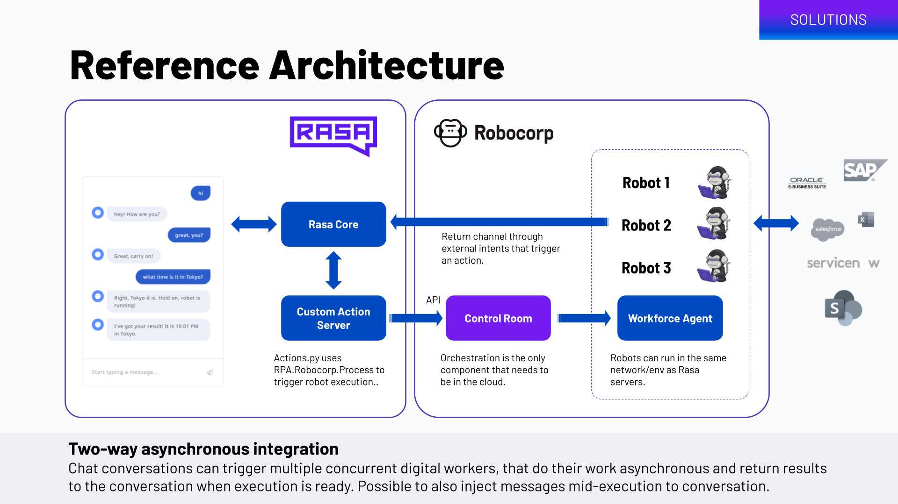

# Rasa chatbot with two-way integration to Robocorp digital workers

This is an example how to set your [Rasa](https://rasa.com/) chatbot up to be able to trigger the execution of [Robocorp](https://robocorp.com/) digital workers (aka robots) through Control Room, and how the robot is able to return it's results back to the conversation. This example pairs with the [robot repo](https://github.com/robocorp/example-rasa-robot).

The reference architecture uses Rasa's default chat interfance channel, and takes you through creating chat intents, custom actions and setting up the communications between Rasa and Robocorp.

[](https://www.loom.com/share/d2a3a3cec5494782980e5da33fa50630)



The example chatbot can have a simple conversation and fetch the current time in difference cities around the world. Like this:

> Me: Hi!

> Bot: Hi, how are you?

> Me: What time is it in Lisbon?

> Bot: Wait a sec I'll get it. _(starts a robot execution)_

> ...

> Bot: Time in Lisbon is 11:35!


## Triggering the robot execution

Triggering the robot execution happens using [Custom Actions](https://rasa.com/docs/rasa/custom-actions/). The majority of things happen in [actions/actions.py](/actions/actions.py) file, but there are a few other things to notice.

Declare the custom action(s) in domain.yml, like this:

```
actions:
  - action_show_time
```

Also remember to make sure that you have necessary configuration for intents, stories and nlu that will trigger the action. We will not cover the setup of these in details in this example, please look for help from Rasa documentation. The code in this repo contains all you need to try out.

Once you have your robot and process set up in [Robocorp Control Room](https://cloud.robocorp.com/), the easiest way to get the workspace ID, process ID and API key that are required for triggering the Process is throught the API Helper.


**IMPORTANT: Copy your Control Room API key, Workspace ID and Process ID to the [settings.py_EXAMPLE](settings.py_EXAMPLE) file, and rename so that the file name is just settings.py.**

## Returning the results of the robot execution to the conversation

As the robot execution might take some time depending on the types of tasks it's performing, it would be considered a best practise to let user know that the execution is started and the results will come back later.

Setting this up requires the use of external events, which on the Rasa configuration are also actions. The [documentation](https://rasa.com/docs/rasa/reaching-out-to-user/#external-events) and [reminderbot example](https://github.com/RasaHQ/rasa/tree/main/examples/reminderbot) are really good sources to get this done. We are using a rule, intent and an action like this in our example:

```
- rule: Bot results
  steps:
  - intent: EXTERNAL_time_result
  - action: action_tell_time
```

You will also need to declare the entities that the robot is returning to the conversation in domain.yml, for example like this:

```
entities:
  - timeresult
  - cityresult
```

Accordingly, the robot will then send back an HTTP POST call to trigger the given intent that has a payload like this:

```
{
	"name": "EXTERNAL_time_result",
	"entities": {
		"timeresult": "12:30",
		"cityresult": "Milan"
	}
}
```

## Running the example

As a prerequisite, you will need these things installed in your environment:

- [Rasa](https://rasa.com/docs/rasa/installation)
- [Spacy](https://pypi.org/project/spacy/)
- Download the English language pipeline with `python -m spacy download en_core_web_md`
- [rpaframework](https://pypi.org/project/rpaframework/)
- Set up the corresponding [Robocorp process](https://github.com/robocorp/example-rasa-robot) first
- [http-server](https://www.npmjs.com/package/http-server) which is used to host the chat UI _(optional)_

To run the example chatbot, perform these actions on three different terminal tabs.

On any terminal, train Rasa language model:

```
rasa train
```

On the first terminal tab, start the custom action server:

```
rasa run actions
```

On the second tab, start the Rasa chatbot server:

```
rasa run --enable-api --cors "*"
```

On the third tab start the http-server that will provide the chat UI. This needs to happen in the root of the repository where the index.html is located.

```
http-server
```

The chatbot is now available on [http://127.0.0.1:8080](http://127.0.0.1:8080). Have fun chatting! If you got it all right, you can ask for example _"What time is it in Helsinki?"_, and the execution is handed over to your digital worker!
